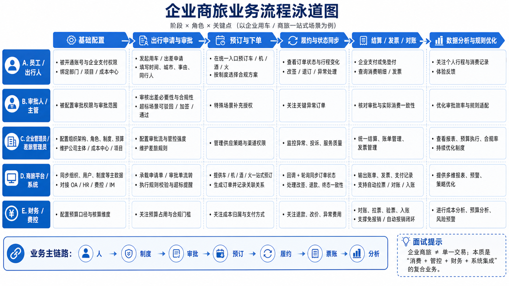

业务流程泳道图 

自采项目简介：这是一个服务于 TPL（第三方物流）行业的 To B 管理后台，目标用户是在满帮平台上运营的物流公司，他们通过这个后台管理货源计划、调度订单、查看经营数据和图表->引到可视化话题。
在自采中开发过最复杂的页面，在其中AI起到了怎样的作用？
答：最复杂的需求是多式联运弹窗，这个弹窗复杂在几个地方：第一是三种模式（新增/编辑/详情）共用一套组件树，同一个字段在不同模式下的可编辑性不一样，而且还要叠加数据状态（比如已找车的单不能改），所以是模式和状态的二维判断；第二是拆单逻辑，用户把一票货拆成多单时要均分重量，手动改某一单时要自动把差值补到最后一单，这里有浮点数精度处理和'谁是最后一个待找车单'的动态判断；第三是找车有三条路径，线上找车要跳页面，我用路由监听来检测回来后刷新，而不是依赖弹窗的生命周期。
追问：1.三种模式（create、edit、detail）共用一套 UI，状态管理是核心难点。同一个输入框，detail模式只读，edit模式需要额外再判断一层子配载状态，只有待找车时才可编辑。按钮和输入框都是模式+状态的二维组合判断，且存在着弹窗自动转换状态的逻辑。2.最复杂-拆单+重量补齐逻辑。是否支持拆单，首先受到段状态限制，拆单数的展示和禁用存在前置判断条件。拆单时，均分重量体积，但需要在最后一单补齐差值；用户修改值，需要在最后一个待找车单自动吸收差值，若用户改的最后一单，则吸收到倒数第二单。3.跨层级事件链，用户在最深层货物表格修改重量，事件冒泡到主弹窗，主弹窗需要直接维护数据，而不是emit回去让子组件改，跨兄弟组件使用emit会非常绕。4.找车存在多条路径，每条路径处理方式不同：指定公路承运商和火车皮打开二级弹窗，独立的表单维护和校验，成功后需要刷新；公路还有一种跳转线上找车，跳转页面后弹窗未关闭，返回时判断是否需要刷新（刷新满足，有id，弹窗开，路径回到了当前页面）。5.初始化时需要promise.all并行请求多个配置，还需要预设置和默认选中运输段。

数据流trade-off：
| 方式 | 优点 | 缺点 | 适用场景 |  
 |---|---|---|  
 | 严格 emit 链 | 数据流清晰，易追踪 | 跨兄弟组件改数据要绕很多层 | 简单表单，单个字段更新 |  
 | 父组件持有数据 + 直接 mutation | 跨兄弟修改简单直接 | 父组件逻辑变重 | 多个子组件数据有联动关系 |  
 | Vuex | 任意组件都能改 | 引入全局状态，过度设计 | 真正的全局共享状态 |

Vue 规范是数据向下 props、事件向上 emit，但这里拆单补差值需要同时修改两个兄弟组件的数据。如果严格走 emit 链，父组件收到事件后还要通过 ref  
 ▎ 去调另一个子组件的方法，或者引入 Vuex，反而更复杂。所以我选择把 segmentList  
 ▎ 完整放在父组件，子组件只负责上报事件，父组件统一处理联动逻辑，这样跨兄弟修改就是直接操作父组件自己的 data，清晰很多。

可视化模块：

1. 在你的工作中是否接触过可视化图表？具体有哪些
   答：我在近期的s级自采项目中在工作台和询价模块用 ECharts 做过数据可视化。工作台是面积折线图展示月度收支和订单趋势，用了 dataZoom 做数据窗口滑动；询价模块是双 Y 轴柱线混合图和供需比折线图，支持分位切换。工程层面处理了图表实例的生命周期管理（beforeDestroy dispose），用 ResizeObserver 加 window.resize 做响应式适配，用 $nextTick 保证 DOM 就绪后再初始化。这个项目数据量不大，没有遇到大数据渲染的性能瓶颈，也没有 WebSocket 实时推送的场景。如果要优化，我会考虑：resize 回调加防抖、ECharts 按需引入减少包体积、大数据量时开启 sampling: 'lttb' 降采样、以及对高频查询结果做内存缓存。在早期的个人项目中，我大量使用过tableau图表，实现快速搭建可视化交互图表，但在商业项目中，echarts一般是首选。采样是多数据取部分，精读换性能；聚合是分维度汇总，适合报表和看板；二者都是为了减少计算传输量，降低前端渲染压力。

2. 现在要做一个企业商旅后台看板，给企业管理员看过去 30 天的 订单量、用车金额、部门分布、异常订单占比和城市热力分布。如果这个页面交给你设计和落地，你会怎么做？
   答：首先考虑这个看板给谁看，要解决什么问题，而不是直接开始选图表。如果主要是是给企业管理员看，他最关心的不是某一笔订单明细，而是整体消费趋势、异常波动、部门使用差异和区域分布。因此我会把需求拆成以下几个模块：1.整体规模，订单量、金额趋势是否正常 2.结构分布，不同地区和城市的消费占比 3.异常点，比如取消率、超标订单、夜间用车占比 4.异常追溯到明细，支持继续排查。拆分需求基础上，再去做技术和图表选型。

3. 那进一步图表具体应该怎么选择?
   答：趋势类，比如过去 30 天订单量、金额变化，我会优先用折线图，因为它最适合看时间变化和波动。对比类，比如各部门订单量、消费金额，我会优先用横向柱状图，因为部门名称通常比较长，横向更容易展示。占比类，比如异常订单占比、不同用车类型占比，我会谨慎使用饼图；如果分类少、只是快速看占比可以用饼图，但如果要更精确比较，我更倾向条形图。地域类，如果是城市分布，可以用地图或者热力图；但如果城市很多，我也会考虑列表加条件筛选，不一定强行上地图。业务方明确需要观察订单和金额的关联关系时，考虑双轴图，但普通使用容易产生误导。

4. Tableau 和前端图表方案怎么选?
   答：Tableau 是一个商业产品，需要付费且需要专业技能，支持两种数据模式：Live Connection和Extract（原数据快照发布到其云服务）。
   Tableau 的优势在于数据连接、建模、发布、共享和权限治理，适合经营分析类 dashboard；ECharts 的优势在于前端定制能力强，适合集成到 React/Vue 后台中做高交互图表。
   前端图表方案，我更推荐使用开源的 echarts，因为其功能丰富，文档清晰，社区活跃，能够支持深度定制与业务场景深度耦合。

5. 技术选型继续深挖，那如果前端自己做，你会选 ECharts、Recharts 还是 D3？为什么？
   这个场景我大概率优先 ECharts。因为它图表类型全，地图、折线、柱状、饼图、tooltip、legend、dataZoom 这些能力都比较成熟，企业后台落地效率高。如果是react中项目中简单的统计图表可以考虑Recharts，心智更一致，但是考虑到未来的拓展和迭代，选择需谨慎。D3 更适合做高定制可视化，开发成本和维护成本更高。SVG是底层绘制能力，但如果节点多渲染压力会很大，只适用于小规模精细交互。

6. 性能问题，如果一个页面渲染多张图表，筛选条件更换全部重刷如何保证性能？
   数据、渲染、交互来看。
   数据上：控制接口粒度，统一筛选条件、请求编排，避免重复请求接口。
   渲染层面，我会控制首屏优先级，先展示核心指标和首屏图表，非首屏图可以延迟渲染或者进入视口再渲染。
   对于数据量大的图，我会做数据采样、聚合，避免前端直接渲染过细的数据点。（？）
   交互层面，我会给筛选加防抖，避免频繁触发；同时对图表实例更新做节制，能 setOption 增量更新的就不整图重建。图表很多，我也会考虑图表组件缓存、统一 resize 管理，避免窗口变化时十几张图反复抖动。
   城市热力图点位特别多，卡了，怎么办-业务上确认是否需要-是则寻求更高性能渲染，不硬抗svg；不是则聚合。

7. 如何判断一个可视化图表是否好？
   判断好的核心标准是能否通过图表快速定位到问题，往往关键不是美观，而是信息设计。比如核心指标、信息层级、对比能力、钻取路径、筛选条件等。最终是否能达到在首屏发现波动，钻取定位具体原因，总体减少人工分析，额外导数的操作。

场景题预演：1.账户资产操作与前端防并发（用户连续点击确认支付）
核心是前后端协同保障幂等。
前端交互防重（按钮禁用，loading等）->
请求防重（同订单只允许一个进行中的请求，前端维护 in-flight 状态。）->
幂等 key（前端生成唯一幂等 key，随请求传给后端，后端做最终保障。）->
状态机设计、结果恢复(支付类场景、不盲目重试，先查单再恢复)
预占补偿（接口获取reservationId，先查状态再恢复，设计释放和恢复逻辑）
稳定性：埋点监控和异常兜底

追问：预占如何恢复 答：重新打开页面时先查状态，如果id过期，则提示用户重新锁定并走流程；如果没有，恢复现场；如果用户主动取消或定义了超时释放，则调用释放接口。前端只保存线索，不直接定义状态。

2. 海量行程数据前端请求和渲染
   查询层 渲染层 交互层 缓存层 稳定性
   查询层：服务端分页、服务端筛选、服务端排序，服务端可以考虑从聚合和采样减少样本量。
   渲染层：如果数据还是很大，考虑虚拟列表；只渲染可视区域的数据，避免 DOM 数量爆炸；另外图表分开渲染，避免频繁的筛选动作导致全部重算。
   交互层：防抖、筛选统一触发、友好的loading和提示
   缓存层：高频查询条件数据做缓存；详情返回列表保留状态；减少请求。
   稳定性：接口耗时、渲染耗时、卡帧率、成功率等

如果涉及地图轨迹和可视化：额外考虑采样或分段加载；重计算放在后端，前端专注渲染。

追问：用户频繁切换筛选条件，如何避免乱序？ 防竞态请求，只采用最后一次请求。

3. 核心服务熔断与前端降级？
   分级：
   强依赖-身份校验、订单提交、支付确认 阻塞并友好提示
   弱依赖-推荐位、热力图、统计卡片 静默处理，降级或隐藏
   中间依赖：价格预估、优惠试算等 需要按业务语义降级

   熔断：短时间内持续超时、报错率升高，前端需介入：接口超时设置、记录失败次数、配合远程配置、动态开关快速降级

   降级：降级策略设计，根据业务场景定制，价格预估-文案提示 地图服务-隐藏不阻塞表单提交 优惠模块-提示暂不可用不阻塞

   开关：核心高流量功能，尽量不依赖前端发版，而是开关可以一键切换、降级

   缓存兜底：弱实时的数据考虑采用最近一次数据，考虑LRU；但核心强依赖的必须采用服务端最新数据。

   稳定性：监控和恢复，观察数据正常后操作恢复开关

4. 单体应用到微前端：
   先评估是否有组织或工程问题：业务模块多，频繁改动同一个仓库、回归成本高、节奏不一致、技术栈等历史包袱导致演进困难等
   微前端核心目标：通过一个容器加载子模块，使得交付、运行风险隔离，支持独立演进。
   具体方案：可能提供一个基座容器，负责公共能力，并能够加载子应用页面。
   大致流程：app预加载容器webview 容器就绪 客户端将url发给容器 容器解析路径 读取项目及micro.json 根据配置加载CDN、chunk、主页面js 注册组件并渲染 稳定性需要考虑降级回退方案

   重点，与qiankun和single-spa对比？
   App 内容器化微前端，不是纯浏览器站点里的路由挂载。它除了前端模块拆分，还涉及App 容器、Bridge、资源预热、客户端缓存、降级回退这些问题，这和单纯的 Web 微前端框架还是不太一样。

5. 实时路径规划：
   “路径规划”可能对应三类不同业务：
   下单前预估：看距离、时长、费用 短时缓存 + 条件失效，缓存key设置业务强相关
   行程中展示：看当前路线和预计到达 当前请求复用，上次结果骨架屏或短暂展示，新结果快速覆盖
   历史轨迹回放：看过去的行程路线 最适合缓存，可以按行程id做本地缓存。

   失效策略： 条件、时间、主动失效
   用户频繁拖动地图或频繁改地址：防抖、同条件请求复用、新情求取消旧请求、只接受最后一次请求，避免乱序等

6. 订单状态机与跨端状态同步（背景，一笔订单多用户在看，员工下单、后台审批、服务侧、账单结算侧）：
   重点是如何保证多端看到的状态变化合理、一致、可恢复。
   需要抽象出清晰的订单状态机：待提交 → 待审批 → 审批通过/驳回 → 待派车 → 待接驾 → 行程中 → 已完成 → 结算中 → 已结算。可能还存在取消分支，此处先不讨论。
   业务层面，状态流转限制：比如已完成不能回退，审批驳回不能进入接驾等。
   前端层面，跨端同步：前端本地状态机负责约束展示和交互，服务端状态才是最终真相。

   同步怎么做：
   实时要求高的状态（已接单、已上车）：WebSocket / SSE / 长连接推送，前端尽快获得状态
   实时要求不高：事件通知 + 页面回前台刷新 + 兜底轮询
   强一致确认点：主动查单确认。

   本地状态机管展示和交互，服务端状态管最终真相；推送负责快，查询负责准，重连后要主动对账
   追问：
   怎么防止状态回退/消息乱序-状态机校验，实时性校验（配合时间戳、版本号），组织错误操作、展示
   弱网、切后台-页面重见确定状态、关键信息不信任本地状态重新请求
   乐观更新：有限乐观更新；本地过渡态：提交中、取消中、同步中；服务端终态：已通过、已取消、已完成、已支付

   状态机就是零星if else收敛成明确的转移表 // 当前状态 + 触发事件 => 下一个状态

所有的回答，都要强调背景，显得更像真实有的经历。

面试官您好，我叫曹友晋，目前在满帮做高级 Web 前端开发工程师，同时在金融小贷域承担一部分 SA 的职责，工作大概 4 年。我的日常工作不只是写页面，也会更前置地参与需求评审、技术方案设计、风险识别，以及质量和稳定性治理。技术栈上我主要用 React、TypeScript，也长期在做 Webpack、工程规范、埋点监控这类工程化建设。

过去这几年我做得比较多的是两类事情。第一类是工程治理和稳定性建设，比如我主导过原生/H5 混合交付向 H5 为主的统一形态收敛，推动 23 个原生页面 H5 化，把小贷 H5 占比从 89% 提到 99%，同时下线了 8.4 万多行冗余代码，补齐了埋点、监控和风险兜底，上线后没有出现线上问题。

第二类是 AI 工程化这块。这个项目里我不是单点做个工具，而是推动了一套从 PRD 拆解、技术方案、代码生成、Code Review、接口联调到 bug 修复的全链路体系落地和优化。这个过程经历了前期试点，项目推广，现在正处于部门横向推广和优化阶段。我自己主导做了 fe-power-prd 这个 CLI，把 PRD 转成功能设计文档和疑惑点清单，同时还配了评估样本和质量防线。最终在一个 300+ 人天的自采项目里，AI 代码占比做到 95%+，整体研发周期缩短 17%，编码时长缩短 32%。这个项目里我承担的核心角色，一方面是方案设计和工具落地，另一方面是把这套AI工作流推进为团队可用、可控、可评估的研发流程。

我这次看滴滴企业前端这个岗位，比较吸引我的也是两点：一是它既要求深入业务，又要求做架构、性能和稳定性，这和我现在在做的事情比较契合；二是企业级出行和商旅场景，本身就很看重体验、交付效率和系统稳定性，我觉得我的项目经历在这类场景里能比较快迁移和发挥价值。

项目题大差不差，主要提到了 
原生和H5的优劣，H5除了发版灵活以外还有什么好处？
AI代码 占比怎么来的，为什么提效不是很明显，当前code review是怎么做的，为什么不闭环成AI全自动化。

代码题

事件循环机制 块级作用域 解决方式 let 和 闭包（立即执行函数）
for (var i = 0; i < 5; i++) {
  setTimeout(() => {
    console.log(i);
  }, 0);
}

// count的展示
function Counter() {
  const [count, setCount] = useState(0);

  useEffect(() => {
    const timer = setInterval(() => {
      setCount(count + 1);
    }, 1000);
    return () => clearInterval(timer);
  }, []);

  return 
{count}
;
}

手写hook ref和state的区别
useRef(count); // ref 引用地址
useState();
